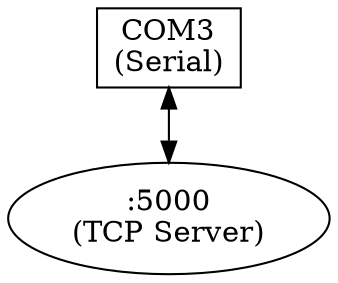

# Bridge Module

## Overview

The Bridge module enables data routing between different transports, creating serial-to-TCP bridges, protocol converters, and multi-hop communication paths.

## Features

| Feature | Status | Description |
|---------|--------|-------------|
| Serial → TCP Server | ✅ | Expose serial port as TCP |
| Serial → TCP Client | ✅ | Connect serial to TCP |
| Bidirectional | ✅ | Two-way data flow |
| Multiple Clients | ✅ | Multi-client TCP server |
| Statistics | ✅ | Byte counters, clients |
| Logging | ✅ | Session logging |
| Routing Graph | ✅ | Visual data paths |
| Path Finding | ✅ | Route calculation |
| DOT Export | ✅ | Graphviz export |
| RFC 2217 | 🔄 | Telnet COM port |
| Load Balancing | ❌ | Future |
| Failover | ❌ | Future |

## Bridge Configuration

```rust
pub struct BridgeConfig {
    pub source: TransportConfig,
    pub destination: TransportConfig,
    pub mode: BridgeMode,
    pub logging: bool,
    pub stats_enabled: bool,
}

pub enum BridgeMode {
    Bidirectional,
    SourceToDestination,
    DestinationToSource,
}
```

## Usage Scenarios

### Serial to TCP Server

Expose a serial port over the network:

```
┌──────────┐         ┌──────────┐         ┌──────────┐
│  Device  │ Serial  │  Bridge  │   TCP   │ Clients  │
│          │◄───────►│  Server  │◄───────►│          │
└──────────┘         └──────────┘         └──────────┘
```

```rust
use termicon_core::bridge::{Bridge, BridgeConfig};

let config = BridgeConfig {
    source: TransportConfig::Serial {
        port: "COM3".to_string(),
        baud_rate: 115200,
    },
    destination: TransportConfig::TcpServer {
        bind_address: "0.0.0.0:5000".to_string(),
    },
    mode: BridgeMode::Bidirectional,
    logging: true,
    stats_enabled: true,
};

let bridge = Bridge::new(config)?;
bridge.start().await?;

// Check statistics
let stats = bridge.stats();
println!("TX: {} bytes, RX: {} bytes, Clients: {}", 
    stats.tx_bytes, stats.rx_bytes, stats.client_count);
```

### Serial to TCP Client

Connect serial port to a remote server:

```
┌──────────┐         ┌──────────┐         ┌──────────┐
│  Device  │ Serial  │  Bridge  │   TCP   │  Server  │
│          │◄───────►│  Client  │◄───────►│          │
└──────────┘         └──────────┘         └──────────┘
```

```rust
let config = BridgeConfig {
    source: TransportConfig::Serial {
        port: "COM3".to_string(),
        baud_rate: 9600,
    },
    destination: TransportConfig::TcpClient {
        address: "192.168.1.100:5000".to_string(),
    },
    mode: BridgeMode::Bidirectional,
    logging: false,
    stats_enabled: true,
};
```

## GUI Usage

### Creating a Bridge

1. Click **Tools** → **Bridge** (or use Command Palette)
2. Configure source transport (e.g., Serial)
3. Configure destination transport (e.g., TCP Server)
4. Set bridge options
5. Click **Start Bridge**

### Bridge Panel

When a bridge is active:
- Status indicator (running/stopped)
- TX/RX byte counters
- Connected clients list (for server mode)
- Log view (if enabled)
- Stop/Restart buttons

## CLI Usage

```bash
# Serial to TCP server
termicon-cli bridge \
  --source serial:COM3:115200 \
  --dest tcp-server:0.0.0.0:5000

# Serial to TCP client
termicon-cli bridge \
  --source serial:/dev/ttyUSB0:9600 \
  --dest tcp-client:192.168.1.100:5000

# With logging
termicon-cli bridge \
  --source serial:COM3:115200 \
  --dest tcp-server:0.0.0.0:5000 \
  --log /var/log/bridge.log
```

## Routing Graph

The routing module provides visual representation of data paths:

### Creating a Routing Graph

```rust
use termicon_core::routing::{RoutingGraph, Node, NodeType};

let mut graph = RoutingGraph::new();

// Add nodes
let serial = graph.add_node(Node {
    id: "serial1".to_string(),
    node_type: NodeType::Serial,
    label: "COM3".to_string(),
    config: Some(serial_config),
});

let tcp = graph.add_node(Node {
    id: "tcp1".to_string(),
    node_type: NodeType::TcpServer,
    label: "TCP :5000".to_string(),
    config: Some(tcp_config),
});

// Add edge (connection)
graph.add_edge(serial, tcp, EdgeConfig {
    bidirectional: true,
    filter: None,
    transform: None,
});

// Find path
let path = graph.find_path("serial1", "tcp1")?;

// Export as DOT for Graphviz
let dot = graph.to_dot();
println!("{}", dot);
```

### DOT Export



## Virtual COM Ports

Create virtual serial port pairs:

### Linux/macOS

```rust
use termicon_core::virtual_port::VirtualPort;

let (master, slave) = VirtualPort::create_pty_pair()?;
println!("Connect applications to: {}", slave.path());

// Data written to master appears on slave and vice versa
```

### Windows

```rust
let port = VirtualPort::create_named_pipe("\\\\.\\pipe\\termicon_com")?;
```

### Use Cases

- Testing serial applications without hardware
- Protocol development and debugging
- Creating loopback connections
- Simulating devices

## Statistics

```rust
pub struct BridgeStats {
    pub tx_bytes: u64,
    pub rx_bytes: u64,
    pub tx_packets: u64,
    pub rx_packets: u64,
    pub client_count: usize,
    pub start_time: SystemTime,
    pub uptime: Duration,
    pub errors: u64,
}
```

## Advanced Features

### Data Filtering

```rust
let config = BridgeConfig {
    // ... other config
    filter: Some(Box::new(|data: &[u8]| {
        // Only pass data starting with 0xAA
        data.first() == Some(&0xAA)
    })),
};
```

### Data Transformation

```rust
let config = BridgeConfig {
    // ... other config
    transform: Some(Box::new(|data: &[u8]| {
        // Add framing
        let mut framed = vec![0x02]; // STX
        framed.extend_from_slice(data);
        framed.push(0x03); // ETX
        framed
    })),
};
```

### Multi-Hop Routing

```rust
// Serial → Filter → Protocol Converter → TCP
let graph = RoutingGraph::new();

graph.add_node(serial_node);
graph.add_node(filter_node);
graph.add_node(converter_node);
graph.add_node(tcp_node);

graph.add_edge(serial_node, filter_node, default_edge());
graph.add_edge(filter_node, converter_node, default_edge());
graph.add_edge(converter_node, tcp_node, default_edge());
```

## Error Handling

```rust
match bridge.start().await {
    Ok(_) => println!("Bridge started"),
    Err(BridgeError::SourceConnectionFailed(e)) => {
        println!("Failed to connect source: {}", e);
    }
    Err(BridgeError::DestinationConnectionFailed(e)) => {
        println!("Failed to connect destination: {}", e);
    }
    Err(e) => println!("Bridge error: {}", e),
}
```

## Troubleshooting

### Connection Issues

- Verify serial port settings match device
- Check network connectivity
- Verify firewall allows traffic
- Check port availability

### Data Not Passing

- Verify bridge mode is correct
- Check for filtering that might block data
- Verify both ends are connected
- Check statistics for activity

### Performance Issues

- Large buffers may add latency
- Consider TCP_NODELAY for real-time
- Check system resources
- Monitor error counters

## Security Considerations

- TCP server binds to all interfaces by default
- Consider firewall rules
- No built-in authentication
- Consider VPN for remote access
